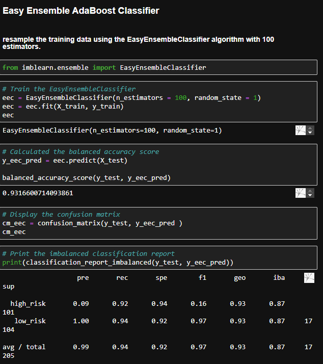

# Credit_Risk_Analysis
Supervised Machine Learning

# Overview of the loan prediction risk analysis:
The following analysis used Supervised Machine Learning models as predictors for credit risk. 
In order to obtain this, algorithms were tested using different type of models, analysing a dataset with the models and figuring out which one was the best predictor for credit risk. 

- Tools: 
Jupyter Notebook, Python.

- Libraries: 
NumPy, SciPy, Scikit-learn, imbalanced-learn

## Machine Learning Models (from A to Z): 
- Balance Random Forest Classifier
- Combination Sampling (SMOTEENN, Over and Under combination) 
- Cluster Centroids Undersampling
- Easy Ensemble ADABoost Classifier
- Naive Random Oversampling
- Smote Oversampling

## Purpose of the study: 
figuring out best Machine Leaning Models to predict credit risk 

# Results:
## Models from analysis apparition

### Balance Random Forest Classifier 
[Link](resources/BalancedRandomF.png)

Balance Accuracy Score: 78.88
Precision - High Risk: 3%
Precision - Low Risk: 100%
Avg/Total - Precision: 99%
Recall - High Risk; 70%
Recall - Low Risk: 87%
Avg/Total - Recall: 87
Avg/Total - f1 score: 93%

### Combination Sampling (SMOTEENN, Over and Under combination) 
[Link](resources/Smoteennoverundercombi.png)

Balance Accuracy Score: 65.44%
Precision - High Risk: 1%
Precision - Low Risk: 100%
Avg/Total - Precision: 99%
Recall - High Risk: 74%
Recall - Low Risk: 57%
Avg/Total - Recall: 57
Avg/Total - f1 score: 72%

### Cluster Centroids Undersampling
[Link](resources/UnderClusterCen.png)

Balance Accuracy Score: 54.31%
Precision - High Risk: 1%
Precision - Low Risk: 100%
Avg/Total - Precision: 99%
Recall - High Risk: 40%
Recall - Low Risk: 68%
Avg/Total - Recall: 40%
Avg/Total - f1 score: 57% 

### Easy Ensemble ADABoost Classifier
[Link](resources/EasyEsenADAB.png)

Balance Accuracy Score: 93.16
Precision - High Risk: 9%
Precision - Low Risk: 100%
Avg/Total - Precision: 99%
Recall - High Risk: 94%
Recall - Low Risk: 92%
Avg/Total - Recall: 92%
Avg/Total - f1 score: 97%

### Naive Random Oversampling
[Link](resources/NaiveRandomOver.png)

Balance Accuracy Score: 67.21%
Precision - High Risk: 1%
Precision - Low Risk: 100%
Avg/Total - Precision: 99%
Recall - High Risk: 72%
Recall - Low Risk: 62%
Avg/Total - Recall: 62%
Avg/Total - f1 score: 76%

### Smote Oversampling
[Link](resources/SmoteOver.png)

Balance Accuracy Score: 64.17%
Precision - High Risk: 1%
Precision - Low Risk: 100%
Avg/Total - Precision: 99%
Recall - High Risk: 60%
Recall - Low Risk: 68%
Avg/Total - Recall: 68%
Avg/Total - f1 score: 80%

# Summary:
Different models were tested for credit risk analysis

## summary of the results 
In the following analysis successful training, splitting and develop of different models were performed. 
After testing multiple models it was seen that the best model that could help with the predictions of credit risk was the Easy Ensemble ADABoost Classifier. In this model the Balanced Accuracy Score was the best among models, but it was seen that a good balanced was obtaining between sensitivity and precision, meaning it was able to discriminate both sensibly and precise compared to the rest. This model score was f1 whereas in comparison, other models showed lower results.  This was shown with overfit in the models as well as low recall. 

Regarding the confusion matrix and classification this had better results when sensitivity, precision and harmony were taken into consideration. 

## Recommendation:
Despite the following analysis performed and made use of different supervised machine learning models, further inspection is recommended. Further training as well as other models might be recommended to obtain a better fitting model that could predict more accurate risk taking into consideration more factors or a more sensitive and precise scores with balance.
